# Live Strategy Dashboard

_Auto-generated from the latest committed strategy state at 2026-09-23T21:48:40.518663+00:00._

> **Live = latest completed GitHub strategy run/candle, not tick-by-tick streaming quotes.**

[Combined performance](all_strategies_combined_latest.md) · [Full trade journal](all_trades_journal.md)

## Open positions

### OB NIFTY 15m — NIFTY

- Status: **OPEN LONG**
- Average/entry: **₹23,403.65**
- Current stored price: **₹23,446.80**
- Quantity: **4.2728377125**
- Unrealized P&L: **₹184.37**
- Latest activity: **BUY BULLISH_OB**

- Exit rule: **Confirmed bearish order block; no fixed numeric stop/target.**

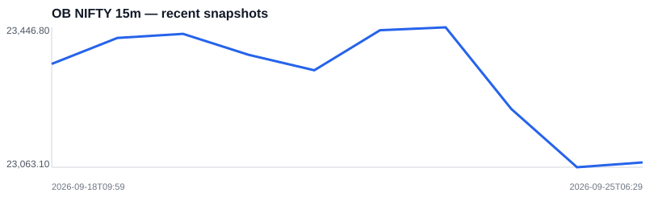

### OB BANKNIFTY 15m — BANKNIFTY

- Status: **OPEN LONG**
- Average/entry: **₹56,523.15**
- Current stored price: **₹56,548.90**
- Quantity: **1.7691866565**
- Unrealized P&L: **₹45.56**
- Latest activity: **BUY BULLISH_OB**

- Exit rule: **Confirmed bearish order block; no fixed numeric stop/target.**

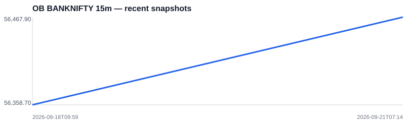

### OB BTCUSDT 15m — BTCUSDT

- Status: **OPEN LONG**
- Average/entry: **₹8,084,207.32**
- Current stored price: **₹8,073,868.48**
- Quantity: **0.0128738458**
- Unrealized P&L: **₹-133.10**
- Latest activity: **BUY BULLISH_OB**

- Exit rule: **Confirmed bearish order block; no fixed numeric stop/target.**

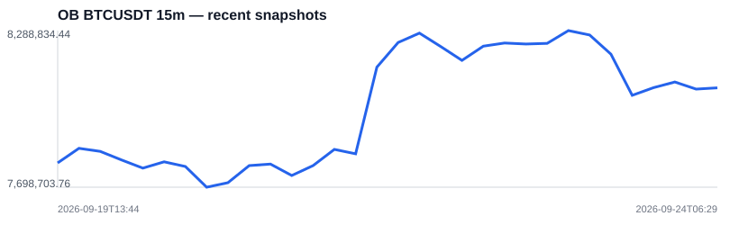

## Strategy status

| Strategy | Status | Equity | P&L | Latest activity | Last processed |
|---|---|---:|---:|---|---|
| Vertex Daily | 0 open | ₹100,000.00 | ₹0.00 | - | 2026-09-23 |
| Vertex 3:15 | 0 open | ₹100,000.00 | ₹0.00 | - | 2026-09-23 |
| Vertex 500 Daily | 0 open | ₹100,033.37 | ₹33.37 | SELL EXIT PFIZER | 2026-09-23 |
| Vertex 500 3:15 | 0 open | ₹100,033.37 | ₹33.37 | SELL EXIT PFIZER | 2026-09-23 |
| OB NIFTY 15m | LONG | ₹100,184.37 | ₹184.37 | BUY BULLISH_OB | 2026-09-23T09:59:59.999000+00:00 |
| OB BANKNIFTY 15m | LONG | ₹100,045.56 | ₹45.56 | BUY BULLISH_OB | 2026-09-23T09:59:59.999000+00:00 |
| OB BTCUSDT 15m | LONG | ₹103,941.74 | ₹3,941.74 | BUY BULLISH_OB | 2026-09-23T20:14:59.999000+00:00 |
| OB XAUUSDT 15m | FLAT | ₹99,246.76 | ₹-753.24 | SELL BEARISH_OB | 2026-09-23T20:14:59.999000+00:00 |
| SMC NIFTY 15m | FLAT | ₹100,051.50 | ₹51.50 | SELL SELL | 2026-09-23T09:59:59.999000+00:00 |
| SMC BANKNIFTY 15m | FLAT | ₹100,039.23 | ₹39.23 | SELL SELL | 2026-09-23T09:59:59.999000+00:00 |
| SMC BTCUSDT 4h | FLAT | ₹100,000.00 | ₹0.00 | SELL | 2026-09-23T15:59:59.999000+00:00 |
| BTCUSDT 15m Existing Strategy | FLAT | $99.5092 | $-0.4908 | BUY_TO_COVER EXIT | 2026-09-23T20:29:59.999000+00:00 |

## Recent strategy charts

### Vertex Daily

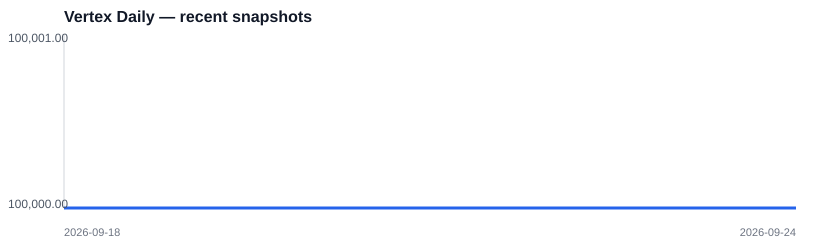

### Vertex 3:15

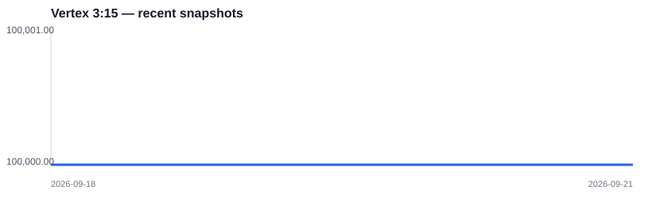

### Vertex 500 Daily

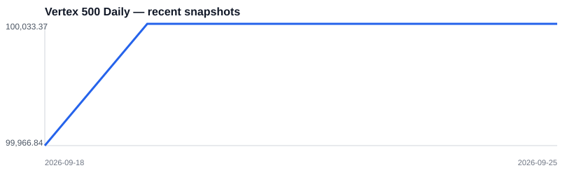

### Vertex 500 3:15

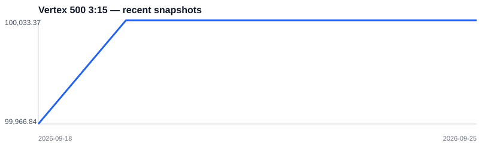

### OB NIFTY 15m

### OB BANKNIFTY 15m

### OB BTCUSDT 15m

### OB XAUUSDT 15m

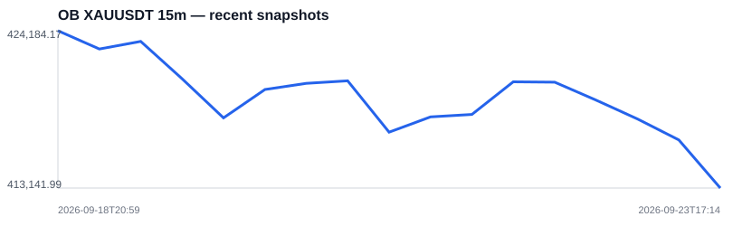

### SMC NIFTY 15m

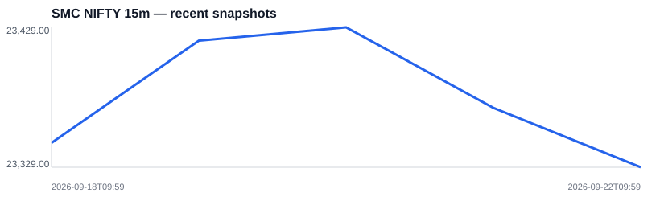

### SMC BANKNIFTY 15m

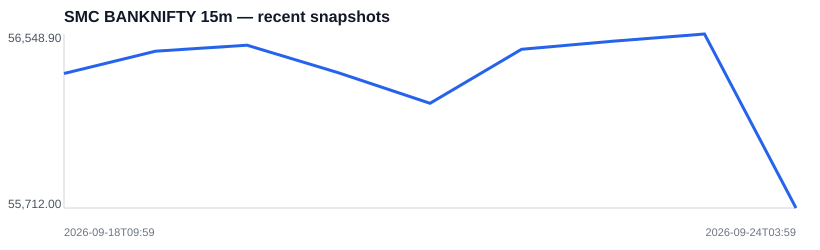

### SMC BTCUSDT 4h

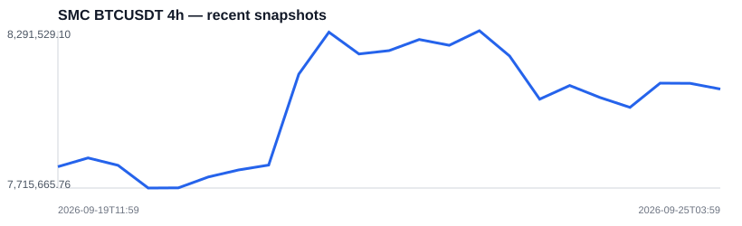

### BTCUSDT 15m Existing Strategy

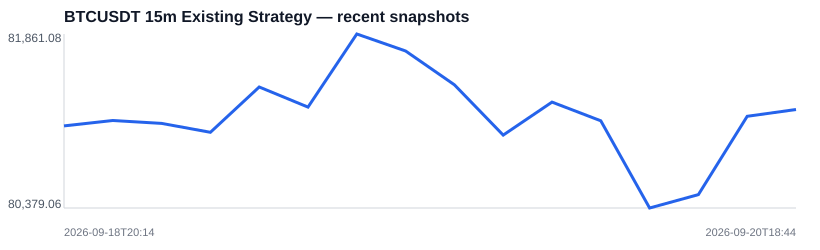

## Automation

- Dashboard rebuilds automatically in the master GitHub reporting workflow.
- The trade journal also updates from GitHub without ChatGPT.
- No ChatGPT subscription or open ChatGPT session is required.
