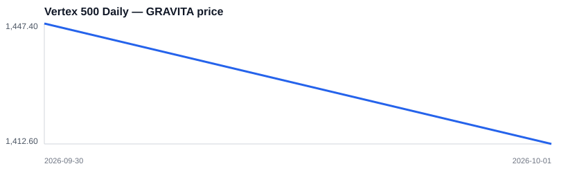

# Live Strategy Dashboard

_Auto-generated from the latest committed strategy state at 2026-10-04T18:02:52.757534+00:00._

> **Live = latest completed GitHub strategy run/candle, not tick-by-tick streaming quotes.**

[Combined performance](all_strategies_combined_latest.md) · [Full trade journal](all_trades_journal.md)

## Open positions

### Vertex Daily — CROMPTON

- Status: **OPEN LONG**
- Entry date: **2026-10-01**
- Entry / average: **₹202.70 / ₹202.70**
- Quantity: **49**
- Capital in trade: **₹9,944.09**
- Latest stored close: **₹202.70**
- Unrealized P&L: **₹-37.43**
- Latest activity: **BUY ENTRY EICHERMOT**

_Position price chart appears automatically after at least two stored position snapshots._

### Vertex Daily — EICHERMOT

- Status: **OPEN LONG**
- Entry date: **2026-10-01**
- Entry / average: **₹6,920.00 / ₹6,920.00**
- Quantity: **1**
- Capital in trade: **₹6,928.22**
- Latest stored close: **₹6,920.00**
- Unrealized P&L: **₹-30.74**
- Latest activity: **BUY ENTRY EICHERMOT**

_Position price chart appears automatically after at least two stored position snapshots._

### Vertex 3:15 — CROMPTON

- Status: **OPEN LONG**
- Entry date: **2026-10-01**
- Entry / average: **₹202.70 / ₹202.70**
- Quantity: **49**
- Capital in trade: **₹9,944.09**
- Latest stored close: **₹202.70**
- Unrealized P&L: **₹-37.43**
- Latest activity: **BUY ENTRY EICHERMOT**

_Position price chart appears automatically after at least two stored position snapshots._

### Vertex 3:15 — EICHERMOT

- Status: **OPEN LONG**
- Entry date: **2026-10-01**
- Entry / average: **₹6,920.00 / ₹6,920.00**
- Quantity: **1**
- Capital in trade: **₹6,928.22**
- Latest stored close: **₹6,920.00**
- Unrealized P&L: **₹-30.74**
- Latest activity: **BUY ENTRY EICHERMOT**

_Position price chart appears automatically after at least two stored position snapshots._

### Vertex 500 Daily — CROMPTON

- Status: **OPEN LONG**
- Entry date: **2026-10-01**
- Entry / average: **₹202.70 / ₹202.70**
- Quantity: **49**
- Capital in trade: **₹9,944.09**
- Latest stored close: **₹202.70**
- Unrealized P&L: **₹-37.43**
- Latest activity: **BUY ENTRY EICHERMOT**

_Position price chart appears automatically after at least two stored position snapshots._

### Vertex 500 Daily — EICHERMOT

- Status: **OPEN LONG**
- Entry date: **2026-10-01**
- Entry / average: **₹6,920.00 / ₹6,920.00**
- Quantity: **1**
- Capital in trade: **₹6,928.22**
- Latest stored close: **₹6,920.00**
- Unrealized P&L: **₹-30.74**
- Latest activity: **BUY ENTRY EICHERMOT**

_Position price chart appears automatically after at least two stored position snapshots._

### Vertex 500 Daily — GRAVITA

- Status: **OPEN LONG**
- Entry date: **2026-09-30**
- Entry / average: **₹1,447.40 / ₹1,447.40**
- Quantity: **6**
- Capital in trade: **₹8,694.71**
- Latest stored close: **₹1,412.60**
- Unrealized P&L: **₹-243.25**
- Latest activity: **BUY ENTRY EICHERMOT**

### Vertex 500 Daily — SJVN

- Status: **OPEN LONG**
- Entry date: **2026-10-01**
- Entry / average: **₹57.91 / ₹57.91**
- Quantity: **172**
- Capital in trade: **₹9,972.35**
- Latest stored close: **₹57.91**
- Unrealized P&L: **₹-37.51**
- Latest activity: **BUY ENTRY EICHERMOT**

_Position price chart appears automatically after at least two stored position snapshots._

### Vertex 500 3:15 — CROMPTON

- Status: **OPEN LONG**
- Entry date: **2026-10-01**
- Entry / average: **₹202.70 / ₹202.70**
- Quantity: **49**
- Capital in trade: **₹9,944.09**
- Latest stored close: **₹202.70**
- Unrealized P&L: **₹-37.43**
- Latest activity: **BUY ENTRY EICHERMOT**

_Position price chart appears automatically after at least two stored position snapshots._

### Vertex 500 3:15 — EICHERMOT

- Status: **OPEN LONG**
- Entry date: **2026-10-01**
- Entry / average: **₹6,920.00 / ₹6,920.00**
- Quantity: **1**
- Capital in trade: **₹6,928.22**
- Latest stored close: **₹6,920.00**
- Unrealized P&L: **₹-30.74**
- Latest activity: **BUY ENTRY EICHERMOT**

_Position price chart appears automatically after at least two stored position snapshots._

### Vertex 500 3:15 — GRAVITA

- Status: **OPEN LONG**
- Entry date: **2026-09-30**
- Entry / average: **₹1,447.40 / ₹1,447.40**
- Quantity: **6**
- Capital in trade: **₹8,694.71**
- Latest stored close: **₹1,412.60**
- Unrealized P&L: **₹-243.25**
- Latest activity: **BUY ENTRY EICHERMOT**

### Vertex 500 3:15 — SJVN

- Status: **OPEN LONG**
- Entry date: **2026-10-01**
- Entry / average: **₹57.91 / ₹57.91**
- Quantity: **172**
- Capital in trade: **₹9,972.35**
- Latest stored close: **₹57.91**
- Unrealized P&L: **₹-37.51**
- Latest activity: **BUY ENTRY EICHERMOT**

_Position price chart appears automatically after at least two stored position snapshots._

### Rahul-606569 Friday 3:15 — ACL

- Status: **OPEN LONG**
- Entry date: **2026-09-25**
- Entry / average: **₹42.63 / ₹42.63**
- Quantity: **702**
- Capital in trade: **₹29,961.80**
- Latest stored close: **₹42.63**
- Unrealized P&L: **₹-81.93**
- Latest activity: **BUY ENTRY NAGAFERT**

_Position price chart appears automatically after at least two stored position snapshots._

### Rahul-606569 Friday 3:15 — AGIIL

- Status: **OPEN LONG**
- Entry date: **2026-09-25**
- Entry / average: **₹264.55 / ₹264.55**
- Quantity: **113**
- Capital in trade: **₹29,929.64**
- Latest stored close: **₹264.55**
- Unrealized P&L: **₹-81.84**
- Latest activity: **BUY ENTRY NAGAFERT**

_Position price chart appears automatically after at least two stored position snapshots._

### Rahul-606569 Friday 3:15 — ASALCBR

- Status: **OPEN LONG**
- Entry date: **2026-09-25**
- Entry / average: **₹644.95 / ₹644.95**
- Quantity: **46**
- Capital in trade: **₹29,702.93**
- Latest stored close: **₹644.95**
- Unrealized P&L: **₹-81.35**
- Latest activity: **BUY ENTRY NAGAFERT**

_Position price chart appears automatically after at least two stored position snapshots._

### Rahul-606569 Friday 3:15 — AVANTIFEED

- Status: **OPEN LONG**
- Entry date: **2026-09-25**
- Entry / average: **₹753.15 / ₹753.15**
- Quantity: **39**
- Capital in trade: **₹29,407.73**
- Latest stored close: **₹753.15**
- Unrealized P&L: **₹-80.69**
- Latest activity: **BUY ENTRY NAGAFERT**

_Position price chart appears automatically after at least two stored position snapshots._

### Rahul-606569 Friday 3:15 — DIL

- Status: **OPEN LONG**
- Entry date: **2026-09-25**
- Entry / average: **₹0.65 / ₹0.65**
- Quantity: **46099**
- Capital in trade: **₹29,999.92**
- Latest stored close: **₹0.65**
- Unrealized P&L: **₹-81.99**
- Latest activity: **BUY ENTRY NAGAFERT**

_Position price chart appears automatically after at least two stored position snapshots._

### Rahul-606569 Friday 3:15 — FCONSUMER

- Status: **OPEN LONG**
- Entry date: **2026-09-25**
- Entry / average: **₹0.22 / ₹0.22**
- Quantity: **136201**
- Capital in trade: **₹29,999.79**
- Latest stored close: **₹0.22**
- Unrealized P&L: **₹-81.99**
- Latest activity: **BUY ENTRY NAGAFERT**

_Position price chart appears automatically after at least two stored position snapshots._

### Rahul-606569 Friday 3:15 — HDIL

- Status: **OPEN LONG**
- Entry date: **2026-09-25**
- Entry / average: **₹1.45 / ₹1.45**
- Quantity: **20665**
- Capital in trade: **₹29,999.82**
- Latest stored close: **₹1.45**
- Unrealized P&L: **₹-81.99**
- Latest activity: **BUY ENTRY NAGAFERT**

_Position price chart appears automatically after at least two stored position snapshots._

### Rahul-606569 Friday 3:15 — NAGAFERT

- Status: **OPEN LONG**
- Entry date: **2026-09-25**
- Entry / average: **₹1.77 / ₹1.77**
- Quantity: **16929**
- Capital in trade: **₹29,999.90**
- Latest stored close: **₹1.77**
- Unrealized P&L: **₹-81.99**
- Latest activity: **BUY ENTRY NAGAFERT**

_Position price chart appears automatically after at least two stored position snapshots._

### Rahul-606569 Friday 3:15 — RAJVIR

- Status: **OPEN LONG**
- Entry date: **2026-09-25**
- Entry / average: **₹5.21 / ₹5.21**
- Quantity: **5751**
- Capital in trade: **₹29,998.28**
- Latest stored close: **₹5.21**
- Unrealized P&L: **₹-81.99**
- Latest activity: **BUY ENTRY NAGAFERT**

_Position price chart appears automatically after at least two stored position snapshots._

### Rahul-606569 Friday 3:15 — RTNPOWER

- Status: **OPEN LONG**
- Entry date: **2026-09-25**
- Entry / average: **₹7.00 / ₹7.00**
- Quantity: **4280**
- Capital in trade: **₹29,995.57**
- Latest stored close: **₹7.00**
- Unrealized P&L: **₹-81.99**
- Latest activity: **BUY ENTRY NAGAFERT**

_Position price chart appears automatically after at least two stored position snapshots._

### Rahul-606569 Friday 3:15 — SUPREME

- Status: **OPEN LONG**
- Entry date: **2026-09-25**
- Entry / average: **₹31.39 / ₹31.39**
- Quantity: **954**
- Capital in trade: **₹29,981.62**
- Latest stored close: **₹31.39**
- Unrealized P&L: **₹-81.97**
- Latest activity: **BUY ENTRY NAGAFERT**

_Position price chart appears automatically after at least two stored position snapshots._

### OB NIFTY 15m — NIFTY

- Status: **OPEN LONG**
- Average/entry: **₹22,445.60**
- Current stored price: **₹22,421.95**
- Quantity: **4.2419367092**
- Unrealized P&L: **₹-100.32**
- Latest activity: **BUY BULLISH_OB**

- Exit rule: **Confirmed bearish order block; no fixed numeric stop/target.**

### OB BANKNIFTY 15m — BANKNIFTY

- Status: **OPEN LONG**
- Average/entry: **₹54,565.10**
- Current stored price: **₹54,450.75**
- Quantity: **1.7606981825**
- Unrealized P&L: **₹-201.34**
- Latest activity: **BUY BULLISH_OB**

- Exit rule: **Confirmed bearish order block; no fixed numeric stop/target.**

### SMC NIFTY 15m — NIFTY

- Status: **OPEN LONG**
- Average/entry: **₹22,769.90**
- Current stored price: **₹22,421.95**
- Quantity: **3.2332446353**
- Unrealized P&L: **₹-1,125.01**
- Latest activity: **BUY BUY**

- Exit rule: **Confirmed opposite major swing; no fixed numeric stop/target.**

### SMC BANKNIFTY 15m — BANKNIFTY

- Status: **OPEN LONG**
- Average/entry: **₹55,046.11**
- Current stored price: **₹54,450.75**
- Quantity: **0.6710081564**
- Unrealized P&L: **₹-399.49**
- Latest activity: **SELL SELL**

- Exit rule: **Confirmed opposite major swing; no fixed numeric stop/target.**

## Strategy status

| Strategy | Status | Equity | P&L | Latest activity | Last processed |
|---|---|---:|---:|---|---|
| Vertex Daily | 2 open | ₹100,102.65 | ₹102.65 | BUY ENTRY EICHERMOT | 2026-10-01 |
| Vertex 3:15 | 2 open | ₹100,102.65 | ₹102.65 | BUY ENTRY EICHERMOT | 2026-10-01 |
| Vertex 500 Daily | 4 open | ₹99,937.97 | ₹-62.03 | BUY ENTRY EICHERMOT | 2026-10-01 |
| Vertex 500 3:15 | 4 open | ₹99,937.97 | ₹-62.03 | BUY ENTRY EICHERMOT | 2026-10-01 |
| Rahul-606569 Friday 3:15 | 11 open | ₹328,077.28 | ₹-899.72 | BUY ENTRY NAGAFERT | 2026-09-25 |
| OB NIFTY 15m | LONG | ₹95,112.49 | ₹-4,887.51 | BUY BULLISH_OB | 2026-10-01T09:59:59.999000+00:00 |
| OB BANKNIFTY 15m | LONG | ₹95,871.34 | ₹-4,128.66 | BUY BULLISH_OB | 2026-10-01T09:59:59.999000+00:00 |
| OB BTCUSDT 15m | FLAT | ₹102,959.74 | ₹2,959.74 | SELL BEARISH_OB | 2026-10-04T16:44:59.999000+00:00 |
| OB XAUUSDT 15m | FLAT | ₹96,239.31 | ₹-3,760.69 | SELL BEARISH_OB | 2026-10-02T20:59:59.999000+00:00 |
| SMC NIFTY 15m | LONG | ₹97,911.71 | ₹-2,088.29 | BUY BUY | 2026-10-01T09:59:59.999000+00:00 |
| SMC BANKNIFTY 15m | LONG | ₹98,476.71 | ₹-1,523.29 | SELL SELL | 2026-10-01T09:59:59.999000+00:00 |
| SMC BTCUSDT 4h | FLAT | ₹101,602.94 | ₹1,602.94 | SELL SELL | 2026-10-04T11:59:59.999000+00:00 |
| BTCUSDT 15m Existing Strategy | FLAT | $99.3030 | $-0.6970 | BUY_TO_COVER EXIT | 2026-10-04T14:14:59.999000+00:00 |

## Recent strategy charts

### Vertex Daily

### Vertex 3:15

### Vertex 500 Daily

### Vertex 500 3:15

### OB NIFTY 15m

### OB BANKNIFTY 15m

### OB BTCUSDT 15m

### OB XAUUSDT 15m

### SMC NIFTY 15m

### SMC BANKNIFTY 15m

### SMC BTCUSDT 4h

### BTCUSDT 15m Existing Strategy

## Automation

- Dashboard rebuilds automatically in the master GitHub reporting workflow.
- The trade journal also updates from GitHub without ChatGPT.
- No ChatGPT subscription or open ChatGPT session is required.
